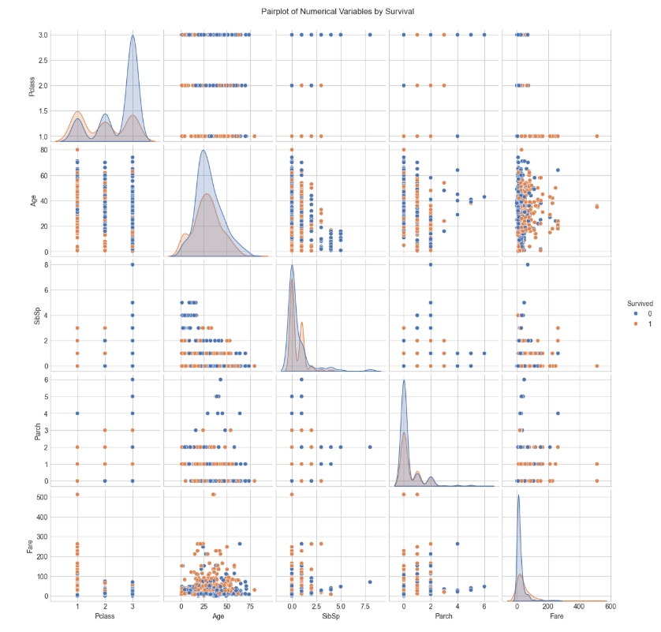

# Titanic Dataset - Exploratory Data Analysis (EDA)

## Overview
This project performs **Exploratory Data Analysis (EDA)** on the Titanic dataset to uncover patterns, relationships, and trends related to passenger survival.

The analysis covers:
- Dataset exploration and structure
- Handling missing values
- Univariate, bivariate, and multivariate analysis
- Visualizations using **Seaborn** and **Matplotlib**
- Key insights and recommendations

---
```text
## Repository Structure

titanic-eda/
│
├── data/
│   ├── train.csv
│   ├── test.csv
│   └── gender_submission.csv
│
├── notebooks/
│   └── titanic_eda.ipynb
│
├── plots/
│   ├── survival_by_factors.png
│   ├── pairplot.png
│   └── correlation_matrix.png
│
├── README.md
└── requirements.txt
```
---

## Key Visuals
### 1. Survival by Passenger Class, Gender, Age Group, and Embarkation Port


### 2. Pairplot of Numerical Variables by Survival


### 3. Correlation Matrix


---

## Tools & Libraries
- Python
- Pandas
- NumPy
- Matplotlib
- Seaborn
- SciPy

---

## How to Run
1. Clone this repository  
   ```bash
   git clone https://github.com/Srusti-26/titanic-eda
   cd titanic-eda
   ```

2. Install dependencies

   ```bash
   pip install -r requirements.txt
   ```
3. Open the Jupyter Notebook

   ```bash
   jupyter notebook notebooks/titanic_eda.ipynb
   ```

---

## Dataset Source

[Titanic: Machine Learning from Disaster - Kaggle](https://www.kaggle.com/competitions/titanic/data)

---

## Summary of Insights

* **Women** had significantly higher survival rates than men.
* **First-class** passengers were more likely to survive compared to other classes.
* **Fare** is positively correlated with survival probability.
* Passengers traveling **with family** had better survival chances.

---
**Note:** The test.csv and gender_submission.csv files are part of the Kaggle Titanic dataset but were not used in this EDA, as survival labels are missing in test.csv. They are typically used for model prediction and Kaggle competition submissions.
---
## Author

**SRUSTI**
